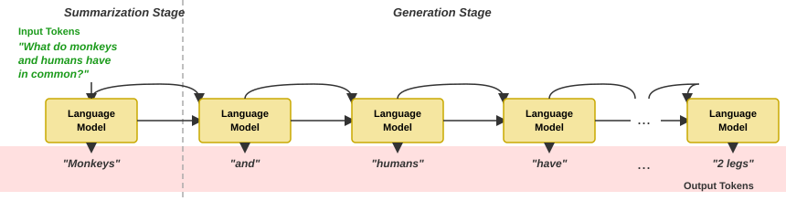

GPTs are not humans! Stop using them like one. I've seen most of my non tech friends use ChatGPT like a therapists. They are already convinced this is the next forthcoming of God himself. 90% of the work is offloaded to AI and 10% of the effort is put into thinking about what to prompt and re-prompt because the previous prompt did not work. The amount of stupidity and timeloss I've people get into using this application it genuinely feels like looking at a monkey trying to do carpentry.

My fellow human, you need to understand a few things. So please let me try. ChatGPT or any kind of LLMs break words into stuff called as tokens. These tokens are then represented as numbers and Machine learning algorithms just try to make sense of these numbers. By storing lots and lots of data they come to the conclusion that there might be some relation between human and monkey. And next time you try to ask questions like "what do monkeys and humans have in common?", the algorithm starts predicting the next word. The prediction phase looks something like,
A more visual representation.

<figure>
  
  <figcaption>Next token generation in Transformer</figcaption>
</figure>

Every single word from question including llm output becomes a part of chat *context*. Context is like memory of an llm and every chat you start only has limited context. It cannot reason taking all the previous information information into account when the context limit has been reached. If you are using a max plan of claude or chatgpt then context/llm_memory is not a concern, because the limit by todays standards is maybe around 1m tokens. Which is a lot unless you are processing extremly large amount of pdfs or academic texts. But for the rest of us poor people the context window is limited, so you have to use it efficiently. 

When you see GPT outputting text like `*You are absolutely right!*`. It probably means it's time to start over by compiling the information you have learned from this chat into bullet points and feed it to a new chat with fresh context.

Don't start with something like, let's build a resume for financial analyst. Rather come up with a plan, knowing that there is only limited GPT can help you with. This means your prompts need to be more direct and to the point. Start with something like, these are my qualifications... these are the type of industries and companies I want to target... this is my work experience and education, now build me a 1 page resume. Feed as much context as you can

One other common mistake I see a lot of people making is not starting a new chat when they want to ask something completely off topic. Remember even the simplest of questions can broaden or shorten the context and LLMs understanding in ways we cannot comprehend, so be as strict as possible to keeping it direct.

Above all of this always remember, tools like LLMs are there to support and amplify your thinking not take it away. The more you look to outsource your thinking to these machines, the more you will loose the cognitive ability to think. Only reason humans surpassed every other species on this planet is because of having the ability to think and reason, don't take it for granted.
